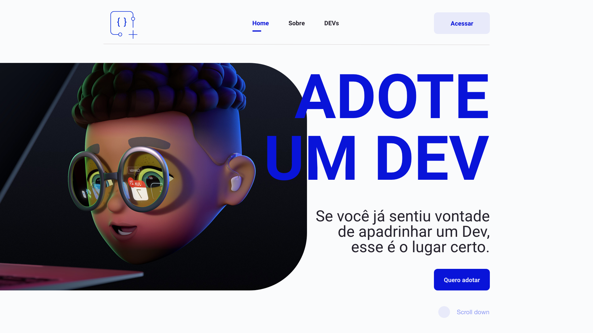
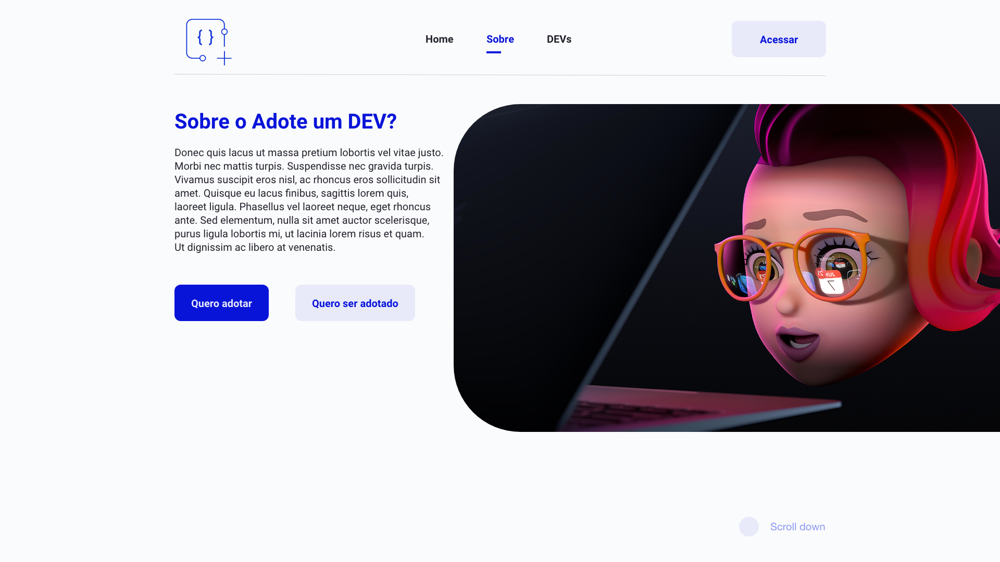

<h1 align="center">Adote um Dev</h1>
<br>
<h3 align="center"> 🚧  The platform is still under development 🚧 </h3>

## About the project 💻 
<hr>
The project was created to help the dev community to grow and help those who are just starting out, you can adopt a dev and thus be the godfather, the one who will help your godson grow.

## Project idea 💡
<hr>
 - Make a connection between people who need help and who want to help
 <br>
 - Further increase the knowledge base of beginning devs.

## Screenshots of platform 🖼
<hr>
 
 
 

## Technologies used 🛠
<hr>
<p align="left">
<a href="https://nextjs.org/" target="_blank">

</a>
-
<a href="https://www.typescriptlang.org/" target="_blank">

</a>
-
<a href="https://sass-lang.com/" target="_blank">

</a>
</p>

## Getting Started 👷
<hr>
To start development, you need to clone the GitHub project into a directory of your choice:

```shell
cd "directory of your choice"
git clone https://github.com/Thejuniordev/adote-um-dev
```

First, run the development server:

```bash
npm run dev
# or
yarn dev
```

Open [http://localhost:3000](http://localhost:3000) with your browser to see the result.

## How to contribute 🤔
<hr>
 - Fork this repository;
 - Create a branch with your feature:

```bash
git checkout -b my-feature
```

 - Commit your changes:

 ```bash
git commmit -m 'my-feature feat: My new feature'
```

 - Faça push para a sua branch:
 ```bash
git push origin my-feature
 ```

Once your pull request has been merged, you can delete your branch.
 ## Author 🎓
 <hr>

<table align="center">
    <tr>
        <td align="center">
            <a href="https://github.com/Thejuniordev">
                
                <br />
                <sub><b>Junior Alves</b></sub>
            </a>
        </td>    
    </tr>
</table>
<br /> 

<h4 align="center">
   Made with 💜  by  <a href="https://www.linkedin.com/in/junior-alves-3a8b3296/" target="_blank"> Junior Alves 👋🏽 Entre em contato!</a>
</h4>

 <a href="https://twitter.com/junyor_alves" target="_blank">
    
  </a>

<hr>

 

